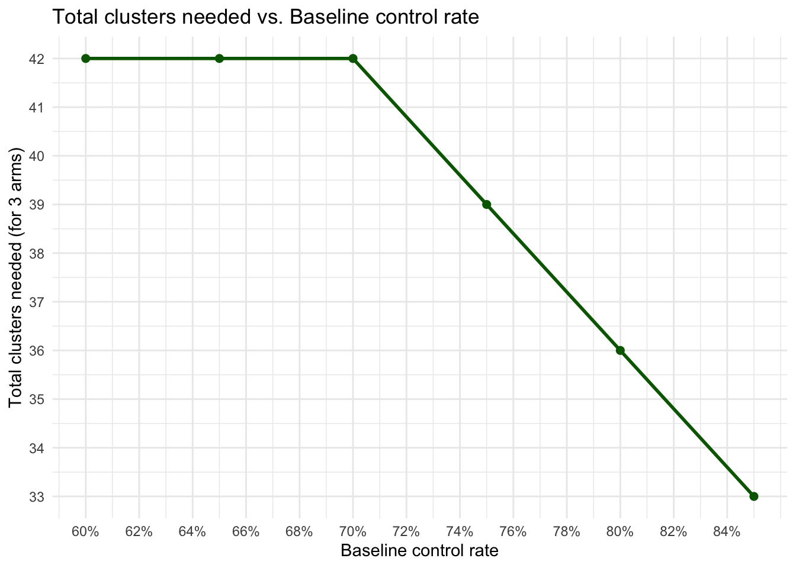
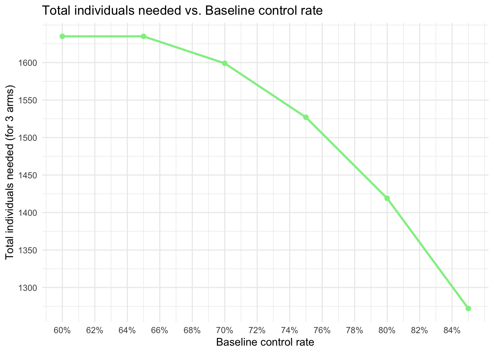
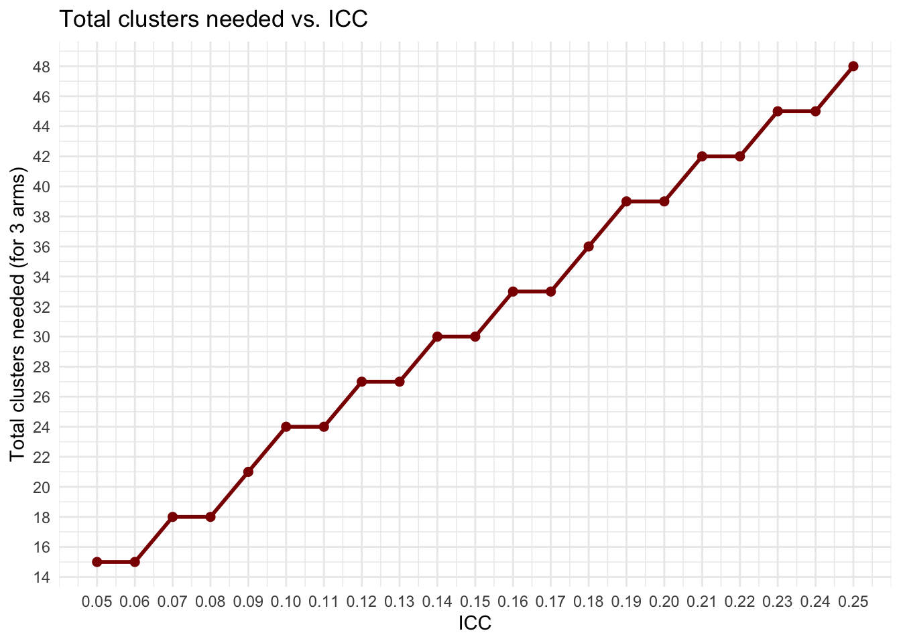
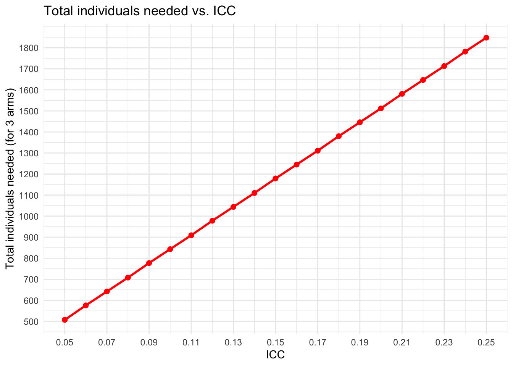

# DAWA cluster randomized trial (CRT)

Interventions on the level of health care workers to reduce antibiotic prescriptions at health facilities in Zanzibar. Multi-arm with 2 interventions:

-   **Control**: Standard of care

-   **Intervention 1**: eHealth tool (CDSS & nudging)

-   **Intervention 2**: eHealth tool (CDSS & nudging) + AMR stewardship clubs

## Parameters

-   Eligible participants: Patients attending the dispensary with acute infectious illness

-   Power for subgroup of kids under 5 years (special subgroup of interest), ca. 33% of all attending patients

-   Cluster size of eligible overall participants: 80-500 per cluster per month (cluster size variation!)

-   Cluster size of eligible kids under 5 years: 26-165 per cluster per month

-   Max. 39 clusters (health dispensaries) due to feasibility/budget

-   Binary outcome: Proportion of patients prescribed an antibiotic at first presentation to care

-   Baseline prescription rate in control clusters: 75%, based on data from existing facilities but some variability

-   Expected delta Control to Intervention 1: 25 percentage points, based on previous studies in same setting

-   Expected delta Control to Intervention 2: 30 percentage points

-   Intervention 1 vs Intervention 2 not of primary interest

-   Desired power min. 80%

-   ICC for AB prescription: 0.2, based on previous studies in same setting, but some uncertainty

-   Mean cluster size: 40/month, but high variability (ratio of standard deviation of cluster sizes to mean of cluster sizes: 0.5-0.6)

-   We expect intervention effect to manifest 3-4 months after baseline

-   Important feasibility aspect: The primary outcome is collected through routine data, while the key secondary outcomes are collected via phone calls

## Design considerations

-   3-arm vs 2x 2-arm? -\> final decision: 3-arm

<!-- -->

-   Recruitment bias? -\> see protocol how to mitigate

-   Secular trend? -\> see protocol re secondary outcome

-   Which pair-wise comparisons to power for? -\> the smaller delta comparison

-   Multiplicity? -\> see separate discussion; decision: No adjustment for multiplicity

**Packages**


::: {.cell}

```{.r .cell-code}
RNGkind("L'Ecuyer-CMRG") # simstudy
set.seed(19287) # for reproducibility
library(simstudy)
library(parallel) # for parallelization of core (max 8 on my laptop)

library(lme4)
library(marginaleffects) # marginal standardization
library(insight) # robust SE
library(geepack) # to tackle alternative and more robust (but less efficient?) estimands

library(dplyr)
library(pwr)
library(ggplot2)
library(kableExtra)
```
:::


# Corresponding individual randomized trial

Sample size for the individual randomized trial on the same question


::: {.cell}

```{.r .cell-code}
# Parameters
p_C <- 0.75 # control: Baseline prescription rate
p_I1 <- 0.50 # int 1: 25pp reduction
p_I2 <- 0.45 # int 2: 30pp reduction
power <- 0.80 # desired power
alpha <- 0.05 # do not apply any (bonferroni) correction for multiplicity (see separate discussion)

# Effect sizes
h_I1_C <- ES.h(p1 = p_I1, p2 = p_C)
h_I2_C <- ES.h(p1 = p_I2, p2 = p_C)

cat("Cohen's h for I1 vs Control:", round(h_I1_C, 3), "\n")
```

::: {.cell-output .cell-output-stdout}

```
Cohen's h for I1 vs Control: -0.524 
```


:::

```{.r .cell-code}
cat("Cohen's h for I2 vs Control:", round(h_I2_C, 3), "\n")
```

::: {.cell-output .cell-output-stdout}

```
Cohen's h for I2 vs Control: -0.624 
```


:::

```{.r .cell-code}
# => reduction of mind. 25% is a Cohen's h of over 0.5 -> medium to large effect according to Cohen

# Sample size first pair-wise comparison (I1 vs C)
ss_I1_C <- pwr.2p.test(h = h_I1_C, sig.level = alpha, power = power)
cat("Sample size per arm (I1 vs C):", ceiling(ss_I1_C$n), "\n")
```

::: {.cell-output .cell-output-stdout}

```
Sample size per arm (I1 vs C): 58 
```


:::

```{.r .cell-code}
# Sample size second pair-wise comparison (I2 vs C)
ss_I2_C <- pwr.2p.test(h = h_I2_C, sig.level = alpha, power = power)
cat("Sample size per arm (I2 vs C):", ceiling(ss_I2_C$n), "\n")
```

::: {.cell-output .cell-output-stdout}

```
Sample size per arm (I2 vs C): 41 
```


:::

```{.r .cell-code}
# Use max of the two
n_per_arm <- max(ceiling(ss_I1_C$n), ceiling(ss_I2_C$n))
n_total <- n_per_arm * 3

cat("Sample size per arm:", n_per_arm, "\n")
```

::: {.cell-output .cell-output-stdout}

```
Sample size per arm: 58 
```


:::

```{.r .cell-code}
cat("Total sample size (3-arm trial):", n_total)
```

::: {.cell-output .cell-output-stdout}

```
Total sample size (3-arm trial): 174
```


:::
:::


A reduction of at least 25% percentage points (the smaller delta of the two) represents a Cohen's h of \>0.5 =\> medium to large effect

# Now, move to a CRT design

## **(1) Standard sample size calculation**

**Figure out the design effect (DEFF) for clustering, to add to the individual RCT sample size**

The usual standard DEFF formula:

DEFF = 1+(m−1)ICC , whereby m = cluster size

However, let's not forget the cluster size variation! The usual conservative adjustment of the DEFF with cluster size variation is:

DEFF_cv = 1+((m(1+CV^2)−1))ICC , whereby CV is the coefficient of variation (ratio of standard deviation of cluster sizes to mean of cluster sizes)

See here: [https://pmc.ncbi.nlm.nih.gov/articles/PMC7394950/#sup1](#0)

Since, we have flexibility in individual sample size per cluster and need to restrict it anyway to keep the data collection for the key secondary outcomes feasible, we decided to take a random sample, same n, from each cluster =\> CV = 0. And we stratify the randomization and adjust the outcome model for actual cluster size (attendance rate)

An individual sample size per cluster (i.e. mean cluster size) of n=150 will be feasible to recruit during 2 months (month 4 and 5 after baseline) from each cluster, using a random sampling strategy. That means we will get n=40 per cluster for our subgroup interest (kids under 5) with minimal CV (CV=0.1).


::: {.cell}

```{.r .cell-code}
# Parameters
p_C <- 0.75 # control: Baseline prescription rate
p_I1 <- 0.50 # int 1: 25pp reduction
p_I2 <- 0.45 # int 2: 30pp reduction
power <- 0.80 # desired power
ICC <- 0.20
alpha <- 0.05 # do not apply any (bonferroni) correction for multiplicity (see separate discussion). Bonferroni would be alpha_familywise / number of comparisons (=2)

m <- 40
CV <- 0.1 # 0 = no cluster size variation

deff <- 1+(m-1)*ICC # standard DEFF
deff_cv <- 1+((m*(1+CV^2))-1)*ICC # DEFF with cluster size variation

# Effect sizes
h_I1_C <- ES.h(p1 = p_I1, p2 = p_C)
h_I2_C <- ES.h(p1 = p_I2, p2 = p_C)

# Individual RCT sample sizes for both contrasts
ss1 <- pwr.2p.test(h = h_I1_C, power = 0.80, sig.level = alpha)$n
ss2 <- pwr.2p.test(h = h_I2_C, power = 0.80, sig.level = alpha)$n

# CRT sample sizes for both contrasts
ss1_crt <- ceiling(ss1 * deff_cv)
ss2_crt <- ceiling(ss2 * deff_cv)

# Contrast 1 (smaller Delta/Cohens'd => determines overall cluster number)
n_clusters1 <- ceiling(ss1_crt / m)
cat("Cluster sample size int arm 1:", n_clusters1, "\n")
```

::: {.cell-output .cell-output-stdout}

```
Cluster sample size int arm 1: 13 
```


:::

```{.r .cell-code}
cat("Individual sample size int arm 1:", ss1_crt, "\n")
```

::: {.cell-output .cell-output-stdout}

```
Individual sample size int arm 1: 509 
```


:::

```{.r .cell-code}
# Contrast 2
n_clusters2 <- ceiling(ss2_crt / m)
cat("Cluster sample size int arm 2:", n_clusters2, "\n")
```

::: {.cell-output .cell-output-stdout}

```
Cluster sample size int arm 2: 9 
```


:::

```{.r .cell-code}
cat("Individual sample size int arm 2:", ss2_crt, "\n")
```

::: {.cell-output .cell-output-stdout}

```
Individual sample size int arm 2: 359 
```


:::

```{.r .cell-code}
# Total
tot_clusters <- n_clusters1 * 3
tot_ind <- ss1_crt * 3
cat("Total cluster sample size:", tot_clusters, "\n")
```

::: {.cell-output .cell-output-stdout}

```
Total cluster sample size: 39 
```


:::

```{.r .cell-code}
cat("Total individual sample size:", tot_ind, "\n")
```

::: {.cell-output .cell-output-stdout}

```
Total individual sample size: 1527 
```


:::
:::


### **(1.1) Varying assumptions - Standard sample size calculation**

#### **(1.1.1) Varying baseline control rate**

All parameters fixed, except baseline control rate versus number of clusters & individuals needed


::: {.cell}

```{.r .cell-code}
# Define fixed parameters
power <- 0.80
alpha <- 0.05
ICC <- 0.20
CV <- 0.1
m <- 40

# Baseline control rates to test
p_C_values <- seq(0.60, 0.85, by = 0.05)

# Initialize an empty dataframe to store results
results_df <- data.frame(
  p_C = numeric(),
  n_clusters_per_arm = numeric(),
  n_individuals_per_arm = numeric()
)

# Function to calculate Cohen's h for two proportions
cohen_h <- function(p1, p2) {
  2 * (asin(sqrt(p1)) - asin(sqrt(p2)))
}

# Loop through each baseline control rate
for (p_C in p_C_values) {
  # Intervention rates based on percentage point reductions
  p_I1 <- p_C - 0.25
  p_I2 <- p_C - 0.30
  
  # Skip if intervention rates are invalid (less than 0)
  if (p_I1 < 0 | p_I2 < 0) {
    next
  }

  # Calculate design effect with no cluster size variation (CV = 0)
  deff_cv <- 1 + ((m * (1 + CV^2)) - 1) * ICC
  
  # Effect sizes for both comparisons
  h_I1_C <- cohen_h(p_I1, p_C)
  h_I2_C <- cohen_h(p_I2, p_C)
  
  # Individual RCT sample sizes for both contrasts
  ss1 <- pwr.2p.test(h = h_I1_C, power = power, sig.level = alpha)$n
  ss2 <- pwr.2p.test(h = h_I2_C, power = power, sig.level = alpha)$n
  
  # Use max of the two to be conservative
  n_per_arm_rct <- max(ss1, ss2)
  
  # CRT sample size per arm (individuals)
  n_per_arm_crt <- ceiling(n_per_arm_rct * deff_cv)
  
  # Number of clusters per arm
  n_clusters_per_arm <- ceiling(n_per_arm_crt / m)
  
  # Append results to the data frame
  results_df <- rbind(results_df, data.frame(
    p_C = p_C,
    n_clusters_per_arm = n_clusters_per_arm,
    n_individuals_per_arm = n_per_arm_crt
  ))
}
```
:::

::: {.cell}

```{.r .cell-code}
ggplot(results_df, aes(x = p_C, y = n_clusters_per_arm * 3)) +
  geom_line(color = "darkgreen", size = 1) +
  geom_point(color = "darkgreen", size = 2) +
  labs(
    title = "Total clusters needed vs. Baseline control rate",
    x = "Baseline control rate",
    y = "Total clusters needed (for 3 arms)"
  ) +
  theme_minimal() +
  scale_x_continuous(labels = scales::percent_format(accuracy = 1),
                     breaks = seq(0.50, 0.85, by = 0.02)) +
  scale_y_continuous(breaks = seq(0, max(results_df$n_clusters_per_arm * 3), by = 1))
```

::: {.cell-output-display}
{width=672}
:::
:::

::: {.cell}

```{.r .cell-code}
ggplot(results_df, aes(x = p_C, y = n_individuals_per_arm * 3)) +
  geom_line(color = "lightgreen", size = 1) +
  geom_point(color = "lightgreen", size = 2) +
  labs(
    title = "Total individuals needed vs. Baseline control rate",
    x = "Baseline control rate",
    y = "Total individuals needed (for 3 arms)"
  ) +
  theme_minimal() +
  scale_x_continuous(labels = scales::percent_format(accuracy = 1),
                     breaks = seq(0.60, 0.85, by = 0.02)) +
  scale_y_continuous(breaks = seq(0, max(results_df$n_individuals_per_arm * 3), by = 50))
```

::: {.cell-output-display}
{width=672}
:::
:::


#### **(1.1.2) Varying ICC**

All parameters fixed, except ICC versus number of clusters & individuals needed


::: {.cell}

```{.r .cell-code}
# Define parameters
power <- 0.80
alpha <- 0.05
p_C <- 0.75 
m <- 40
CV <- 0.1

# Range of ICC values to test
ICC_values <- seq(0.05, 0.25, by = 0.01)

# Initialize an empty dataframe to store results
results_df <- data.frame(
  ICC = numeric(),
  n_clusters_per_arm = numeric(),
  n_individuals_per_arm = numeric()
)

# Function to calculate Cohen's h for two proportions
cohen_h <- function(p1, p2) {
  2 * (asin(sqrt(p1)) - asin(sqrt(p2)))
}

# Loop through each ICC value
for (icc in ICC_values) {
  # Intervention rates based on percentage point reductions
  p_I1 <- p_C - 0.25
  p_I2 <- p_C - 0.30
  
  # Calculate design effect
  deff <- 1 + (m - 1) * icc
  
  # Effect sizes for both comparisons
  h_I1_C <- cohen_h(p_I1, p_C)
  h_I2_C <- cohen_h(p_I2, p_C)
  
  # Individual RCT sample sizes for both contrasts
  ss1 <- pwr.2p.test(h = h_I1_C, power = power, sig.level = alpha)$n
  ss2 <- pwr.2p.test(h = h_I2_C, power = power, sig.level = alpha)$n
  
  # Use max of the two to be conservative
  n_per_arm_rct <- max(ss1, ss2)
  
  # CRT sample size per arm (individuals)
  n_per_arm_crt <- ceiling(n_per_arm_rct * deff)
  
  # Number of clusters per arm
  n_clusters_per_arm <- ceiling(n_per_arm_crt / m)
  
  # Append results to the data frame
  results_df <- rbind(results_df, data.frame(
    ICC = icc,
    n_clusters_per_arm = n_clusters_per_arm,
    n_individuals_per_arm = n_per_arm_crt
  ))
}
```
:::

::: {.cell}

```{.r .cell-code}
ggplot(results_df, aes(x = ICC, y = n_clusters_per_arm * 3)) +
  geom_line(color = "darkred", size = 1) +
  geom_point(color = "darkred", size = 2) +
  labs(
    title = "Total clusters needed vs. ICC",
    x = "ICC",
    y = "Total clusters needed (for 3 arms)"
  ) +
  theme_minimal() +
  scale_x_continuous(breaks = seq(0.05, 0.25, by = 0.01)) +
  scale_y_continuous(breaks = seq(0, max(results_df$n_clusters_per_arm * 3), by = 2))
```

::: {.cell-output-display}
{width=672}
:::
:::

::: {.cell}

```{.r .cell-code}
ggplot(results_df, aes(x = ICC, y = n_individuals_per_arm * 3)) +
  geom_line(color = "red", size = 1) +
  geom_point(color = "red", size = 2) +
  labs(
    title = "Total individuals needed vs. ICC",
    x = "ICC",
    y = "Total individuals needed (for 3 arms)"
  ) +
  theme_minimal() +
  scale_x_continuous(breaks = seq(0.05, 0.25, by = 0.02)) +
  scale_y_continuous(breaks = seq(0, max(results_df$n_individuals_per_arm * 3), by = 100))
```

::: {.cell-output-display}
{width=672}
:::
:::


#### **(2) Let's figure out the outcome model** 

We have a binary outcome and plan to use a mixed-effects logistic model to model the log-odds (logit) of success. We convert the linear predictor into a probability using the inverse logit (logistic function) and will draw from a Bernoulli distribution:

P(Y_ij=1) = e_nij/(1+e_nij) , whereby nij = c_j + β*rx_j (the linear predictor for individual i in cluster j)

-   c_j = the random cluster effect (cluster-specific deviation from the overall average)

-   β = the regression coefficient

-   rx_j = the treatment status of cluster j

After fitting the logistic regression, the inverse logit function is used to convert the log-odds (i.e., e_nij) back into a probability.

**(3) Let's figure out the ICC:** ICC=textBetween−sitevariance/textTotalvariance, whereby the between-site variance represents the clustering.

In logistic models, the ICC is usually fixed at: pi2/3=3.29 for the residual level (individual variation).

So, the between-site variance (sigma2_c), i.e. cluster-level noise, is what we need, and is therefore derived as:

ICC=sigma2_c/(sigma2_c+(pi2/3))

(If there’s additional within-site variation over time, i.e. baseline period, we include sigma2_cp, typically as a fraction of sigma2_c, e.g., half the site-level variance -\> for a later stage).
