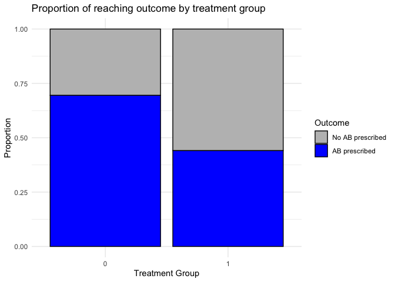
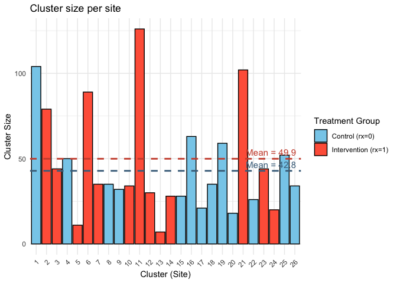
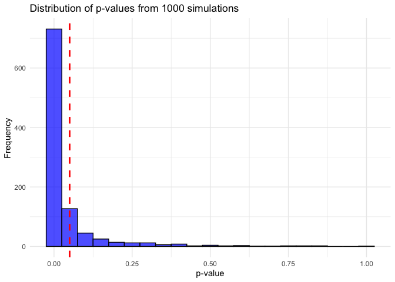

Packages

```r
RNGkind("L'Ecuyer-CMRG") # simstudy
set.seed(19287) # for reproducibility
library(simstudy)
library(parallel) # for parallelization of core (max 8 on my laptop)

library(lme4)
library(glmmTMB) # robust SE
library(marginaleffects) # robust SE
library(insight) # robust SE

library(dplyr)
library(pwr)
library(ggplot2)
library(kableExtra)
```

# Hypothetical MOCA cluster randomized trial (CRT)
Several interventions on the level of health care workers to reduce antibiotic prescriptions at health facilities

Control: Standard of care

Intervention 1: eHealth tool

Intervention 2: eHealth tool + AMR stewardship clubs

Important features and fixed parameters:
- Max. 39 clusters (health centers) due to feasibility/budget
- Binary outcome: Proportion of patients prescribed an antibiotic at first presentation to care
- Baseline prescription rate at control clusters: 75%
- Delta Control to Intervention 1: 25 percentage points, based on previous studies in same setting
- Delta Control to Intervention 2: 30 percentage points, based on previous studies in same setting
- Power min. 80%
- ICC for AB prescription: 0.2, based on previous studies in same setting
- Mean cluster size: 40/month, max. feasible recruitment duration is 5 month => max. mean cluster 200
- There is a variation in cluster size, ratio of standard deviation of cluster sizes to mean of cluster sizes: 0.6-0.8

Design considerations:
- 3-arm vs 2x 2-arm?
- Recruitment bias?
- Secular trend?
- Which pair-wise comparisons to power for?
- Multiplicity?


## First, just as a comparison, a simple individual randomized trial for the same question

```r
# Parameters
alpha <- 0.05
p_C <- 0.75 # control: Baseline prescription rate
p_I1 <- 0.50 # int 1: 25pp reduction
p_I2 <- 0.45 # int 2: 30pp reduction
power <- 0.8 # desired power
alpha <- 0.05 # apply bonferroni correction if adjustment for multiplicity

# Effect sizes
h_I1_C <- ES.h(p1 = p_I1, p2 = p_C)
h_I2_C <- ES.h(p1 = p_I2, p2 = p_C)

cat("Cohen's h for I1 vs Control:", round(h_I1_C, 3), "\n")
```

```
## Cohen's h for I1 vs Control: -0.524
```

```r
cat("Cohen's h for I2 vs Control:", round(h_I2_C, 3), "\n")
```

```
## Cohen's h for I2 vs Control: -0.624
```

```r
# => reduction of mind. 25% is a Cohen's d of over 0.5 -> medium to large effect according to Cohen

# Sample size first pair-wise comparison (I1 vs C)
ss_I1_C <- pwr.2p.test(h = h_I1_C, sig.level = alpha, power = power)
cat("Sample size per arm (I1 vs C):", ceiling(ss_I1_C$n), "\n")
```

```
## Sample size per arm (I1 vs C): 58
```

```r
# Sample size second pair-wise comparison (I2 vs C)
ss_I2_C <- pwr.2p.test(h = h_I2_C, sig.level = alpha, power = power)
cat("Sample size per arm (I2 vs C):", ceiling(ss_I2_C$n), "\n")
```

```
## Sample size per arm (I2 vs C): 41
```

```r
# Use max of the two
n_per_arm <- max(ceiling(ss_I1_C$n), ceiling(ss_I2_C$n))
n_total <- n_per_arm * 3

cat("Sample size per arm:", n_per_arm, "\n")
```

```
## Sample size per arm: 58
```

```r
cat("Total sample size (3-arm trial):", n_total)
```

```
## Total sample size (3-arm trial): 174
```
A reduction of at least 25% percentage points is a Cohen's d of over 0.5 => medium to large effect.

Adjust for multiplicity yes/no? TBD


## Now, move to a CRT design

(1) Let's figure out the design effect for clustering, to add to individual RCT sample size.

The usual: DEFF = 1 + (m − 1) x ICC, whereby m = cluster size

However, let's not forget the cluster size variation! The usual conservative adjustment of the DEFF with cluster size variation:

DEFF_cv = 1 + (m x (1 + CV^2) - 1) x ICC, whereby CV is the coefficient of variation (ratio of standard deviation of cluster sizes to mean of cluster sizes)
Same as implemented and recommended here: https://pmc.ncbi.nlm.nih.gov/articles/PMC7394950/#sup1

(2) Let's figure out the outcome model:
We have a binary outcome and will use a logistic model to model the log-odds (logit) of success.
So, we have to convert the linear predictor into a probability using the inverse logit (logistic function) and will draw form a Bernoulli distribution:

P(Y_ij = 1) = e_ηij / 1 + e_ηij, whereby ηij = c_j + β x rx_j (the linear predictor for individual i in cluster j)
c_j = the random cluster effect (cluster-specific deviation from the overall average)
β = the regression coefficient,
rx_j = the treatment status of cluster j

After fitting the logistic regression, the inverse logit function is used to convert the log-odds (i.e. ηij) back into a probability.

(3) Let's figure out the ICC:
ICC = Between-site variance / Total variance, whereby the between-site variance represents the clustering. 

In logistic models, the ICC is usually fixed at: π^2 / 3 = 3.29 for the residual level (individual variation).

So, the between-site variance (σ^2c), i.e. cluster-level noise, is what we need, and is therefore derived as:

ICC = σ^2c / σ^2c + (π^2 / 3)

(If there’s additional within-site variation over time, i.e. baseline period, we include σ^2cp, typically as a fraction of σ^2c, e.g., half the site-level variance -> for a later stage).

```r
# Parameters
p_C <- 0.75 # control: Baseline prescription rate
p_I1 <- 0.50 # int 1: 25pp reduction
p_I2 <- 0.45 # int 2: 30pp reduction
power <- 0.8 # desired power
ICC <- 0.20

m <- 40

alpha_familywise <- 0.05
k <- 2  # number of comparisons
alpha_bonf <- alpha_familywise # no correction for now!
# alpha_bonf <- alpha_familywise / k # Bonferroni corrected alpha

CV <- 0 # no variation
CV <- 0.6 # 0.6 variation

deff <- 1 + (m-1) * ICC
deff_cv <- 1 + ((m*(1+CV^2))-1) * ICC # with cluster size variation

# Effect sizes
h_I1_C <- ES.h(p1 = p_I1, p2 = p_C)
h_I2_C <- ES.h(p1 = p_I2, p2 = p_C)

# Individual RCT sample sizes for both contrasts
ss1 <- pwr.2p.test(h = h_I1_C, power = 0.80, sig.level = alpha_bonf)$n  # for I1 vs C (individual trial)
ss2 <- pwr.2p.test(h = h_I2_C, power = 0.80, sig.level = alpha_bonf)$n  # for I2 vs C (individual trial)

# CRT sample sizes for both contrasts
ss1_crt <- ss1 * deff_cv
ss2_crt <- ss2 * deff_cv

# Contrast 1 (smaller Delta/Cohens'd => determines overall cluster number)
n_clusters1 <- ceiling(ss1_crt / m)
cat("Cluster sample size int arm 1:", n_clusters1, "\n")
```

```
## Cluster sample size int arm 1: 17
```

```r
cat("Individual sample size int arm 1:", ss1_crt, "\n")
```

```
## Individual sample size int arm 1: 668.7783
```

```r
# Contrast 2
n_clusters2 <- ceiling(ss2_crt / m)
cat("Cluster sample size int arm 2:", n_clusters2, "\n")
```

```
## Cluster sample size int arm 2: 12
```

```r
cat("Individual sample size int arm 2:", ss2_crt, "\n")
```

```
## Individual sample size int arm 2: 471.2332
```

```r
# Total
tot_clusters <- n_clusters1 * 3
tot_ind <- ss1_crt * 3
cat("Total sample size clusters:", tot_clusters, "\n")
```

```
## Total sample size clusters: 51
```

```r
cat("Total sample size individuals:", tot_ind, "\n")
```

```
## Total sample size individuals: 2006.335
```
With CV = 0 => 13 clusters per arm => 39 clusters in total with mean m=40 => ca. 1512 participants 

With CV = 0.6 => 17 clusters per arm => 51 clusters in total with mean m=40 => ca. 2007 participants 

With CV = 0.6 & bonferroni correction => 21 clusters per arm => 63 clusters in total with mean m=40 => ca. 2430 participants

Cluster size increase to m=200 helps little as expected (reduce 2-3 clusters in total)


## Let's generate the data
Using simstudy: https://kgoldfeld.github.io/simstudy/articles/simstudy.html

### Generate a three-arm trial directly
CAVE: It works, but only if I model all outcomes in 1 model (probably not the smartest), hence move to a simpler two-arm trial setup

```r
# # Define the function to simulate a multi-arm cluster randomized trial
# crt_binary_multiarm_varsize <- function(n_clusters, p0, p1, p2, ICC, cluster_size_mean, cluster_size_sd) {
#   
#   # Convert probabilities to logits
#   logit_p0 <- log(p0 / (1 - p0))  # control
#   logit_p1 <- log(p1 / (1 - p1))  # intervention 1
#   logit_p2 <- log(p2 / (1 - p2))  # intervention 2
# 
#   # Treatment effects (contrasts)
#   beta1 <- logit_p1 - logit_p0  # effect of intervention 1 vs control
#   beta2 <- logit_p2 - logit_p0  # effect of intervention 2 vs control
#   
#   # Step 1: Define the cluster-level treatment assignment (3 arms: control, intervention 1, intervention 2)
#   defC <- defData(varname = "rx", formula = "1;1;1", dist = "trtAssign")
#   
#   # Step 2: Simulate cluster sizes (mean and sd specified by user)
#   cluster_sizes <- rnorm(n_clusters, mean = cluster_size_mean, sd = cluster_size_sd)
#   
#   # Step 3: Define the random effects (ICC) at the cluster level
#   # Between-cluster variance (σ^2c) from ICC
#   sigma2_c <- ICC * (pi^2 / 3) / (1 - ICC)
#   cat("Between-site variance (σ^2c):", sigma2_c, "\n")
#   
#   # Add random effect at cluster level
#   defC <- defData(defC, varname = "c", formula = "0", variance = sigma2_c, dist = "normal")
#   
#   # Step 4: Define individual-level outcome
#   # Step: Add individual-level binary outcome with two treatment contrasts
#   defS <- defDataAdd(varname = "y", 
#                    formula = paste0("c + ", 
#                                     logit_p0, " + ", 
#                                     beta1, " * (rx == 1) + ", 
#                                     beta2, " * (rx == 2)"),
#                    dist = "binary", link = "logit")
#   
#   # Step 5: Generate data for clusters and participants
#   dc <- genData(n_clusters, defC, id = "site")
#   
#   # Step 6: Generate individual-level data (participants per cluster)
#   dd <- genCluster(dc, "site", cluster_sizes, "id")
#   
#   # Step 7: Add individual-level outcome (response) to the data
#   dd <- addColumns(defS, dd)
#   
#   return(dd)
# }
# 
# # Now, let's run the simulation with your parameters
# set.seed(123)  # Set seed for reproducibility
# dd_sim <- crt_binary_multiarm_varsize(
#   n_clusters = 39, 
#   p0 = 0.75, 
#   p1 = 0.50, 
#   p2 = 0.45, 
#   ICC = 0.20, 
#   cluster_size_mean = 40, 
#   cluster_size_sd = 0.8
# )
# 
# # Check the simulated dataset
# table(dd_sim$site)
# table(dd_sim$rx)
# 
# # Check the proportions
# prop_1 <- mean(dd_sim$y[dd_sim$rx == 1])  
# prop_2 <- mean(dd_sim$y[dd_sim$rx == 2])
# prop_3 <- mean(dd_sim$y[dd_sim$rx == 3])
# 
# cat("Observed success rate arm 1:", prop_1, "\n")
# cat("Observed success rate arm 2:", prop_2, "\n")
# cat("Observed success rate arm 3:", prop_3, "\n")
# 
# # Visualize the outcome distribution for each treatment group
# ggplot(dd_sim, aes(x = factor(rx), fill = factor(y))) + 
#   geom_bar(position = "fill", color = "black") + 
#   scale_fill_manual(values = c("gray", "blue"), labels = c("Failure", "Success")) +
#   labs(x = "Treatment Group", y = "Proportion", fill = "Outcome") +
#   theme_minimal() +
#   ggtitle("Proportion of Success by Treatment Group in Multi-Arm Cluster CRT")
```

### Generate a two-arm trial, based on primary and sample size determining contrast
That means max 26 clusters, all other parameters remain the same

```r
crt_binary_twoarm_varsize <- function(n_clusters, p0, p1, ICC, cluster_size_mean, CV) {
  
  logit_p0 <- log(p0 / (1 - p0))
  logit_p1 <- log(p1 / (1 - p1))
  beta1 <- logit_p1 - logit_p0

  # Treatment variable "rx"
  defC <- defData(varname = "rx", formula = "1;1", dist = "trtAssign")
  
  # Cluster sizes, two options:
  
  # (1) Normal distribution and calculate SD from CV, as per formula
  # cluster_size_sd <- CV * cluster_size_mean
  # cluster_sizes <- round(rnorm(n_clusters, mean = cluster_size_mean, sd = cluster_size_sd)) # ensure no empty nor negative cluster sizes
  
  # (2) Use a gamma distribution to simulate strictly positive, slightly right-skewed cluster sizes (as common in real data, i.e., few large ones)
  shape <- 1 / CV^2
  scale <- cluster_size_mean * CV^2
  cluster_sizes <- round(rgamma(n_clusters, shape = shape, scale = scale))

  # ICC and cluster-level random effect
  sigma2_c <- ICC * (pi^2 / 3) / (1 - ICC)
  cat("Between-site variance (σ^2c):", sigma2_c, "\n")
  defC <- defData(defC, varname = "c", formula = "0", variance = sigma2_c, dist = "normal")

  # Generate the clusters, variable "site"
  dc <- genData(n_clusters, defC, id = "site")

  # Generate the individuals, variable "id"
  dd <- genCluster(dc, "site", cluster_sizes, "id")

  # Add individual-level noise
  dd <- addColumns(defDataAdd(varname = "noise", formula = "0", variance = 1.0, dist = "normal"), dd)

  # Outcome model, based on individual-level outcomes, variable "y" (y = 1/0)
  defS <- defDataAdd(varname = "y", 
                     formula = paste0("c + noise + ", logit_p0, " + ", beta1, " * (rx == 1)"),
                     dist = "binary", link = "logit")
  dd <- addColumns(defS, dd)

  return(dd)
}

# set.seed(342)  # Set seed for reproducibility

dd_sim <- crt_binary_twoarm_varsize(
  n_clusters = 26, 
  p0 = 0.75, 
  p1 = 0.50,
  ICC = 0.20, 
  cluster_size_mean = 40, 
  CV = 0.6
)
```

```
## Between-site variance (σ^2c): 0.822467
```

```r
## Check the simulated dataset
# table(dd_sim$rx, dd_sim$site)
table(dd_sim$rx)
```

```
## 
##   0   1 
## 557 649
```

```r
# Check the proportions
prop_1 <- mean(dd_sim$y[dd_sim$rx == 0])  
prop_2 <- mean(dd_sim$y[dd_sim$rx == 1])

# Visualize the outcome distribution for each treatment group
ggplot(dd_sim, aes(x = factor(rx), fill = factor(y))) + 
  geom_bar(position = "fill", color = "black") + 
  scale_fill_manual(values = c("gray", "blue"), labels = c("No AB prescribed", "AB prescribed")) +
  labs(x = "Treatment Group", y = "Proportion", fill = "Outcome") +
  theme_minimal() +
  ggtitle("Proportion of reaching outcome by treatment group")
```

<!-- -->

```r
# Visualize the clusters and their variability
cluster_summary <- dd_sim %>%
  group_by(site, rx) %>%
  summarise(cluster_size = n(), .groups = "drop")
mean_sizes <- cluster_summary %>%
  group_by(rx) %>%
  summarise(mean_size = mean(cluster_size))
ggplot(cluster_summary, aes(x = factor(site), y = cluster_size, fill = factor(rx))) +
  geom_bar(stat = "identity", color = "black") +
  geom_hline(data = mean_sizes, aes(yintercept = mean_size, color = factor(rx)), 
             linetype = "dashed", size = 1, show.legend = FALSE) +
  geom_text(data = mean_sizes, aes(x = Inf, y = mean_size, label = paste0("Mean = ", round(mean_size, 1))),
            hjust = 1.1, vjust = -0.5, color = c("skyblue4", "tomato3"), size = 4) +
  scale_fill_manual(values = c("skyblue", "tomato"), labels = c("Control (rx=0)", "Intervention (rx=1)")) +
  scale_color_manual(values = c("skyblue4", "tomato3")) +
  labs(x = "Cluster (Site)", y = "Cluster Size", fill = "Treatment Group") +
  theme_minimal() +
  ggtitle("Cluster size per site") +
  theme(axis.text.x = element_text(angle = 45, hjust = 1))
```

<!-- -->

### Let's estimate the effect size

```r
# Ensure treatment variable is a factor with "control" as reference
dd_sim <- dd_sim %>%
  mutate(rx = factor(rx)) %>%
  mutate(rx = relevel(rx, ref = "0"))

# model <- glmer(y ~ rx + (1 | site), data = dd_sim, family = binomial)
model <- glmmTMB(y ~ rx + (1 | site), data = dd_sim, family = binomial) # use glmmTMB instead to get RSEs via marginaleffects package

# Wald
wald <- summary(model)$coefficients$cond
wald_est <- wald["rx1", "Estimate"]
wald_se <- wald["rx1", "Std. Error"]
wald_pval <- wald["rx1", "Pr(>|z|)"]
wald_lower <- wald_est - 1.96 * wald_se
wald_upper <- wald_est + 1.96 * wald_se

# Cluster-robust SEs
vcov_cr <- get_vcov(model, type = "CR2", cluster = dd_sim$site)
params <- get_parameters(model)
robust_est <- params$Estimate[params$Parameter == "rx1"]
robust_se <- sqrt(diag(vcov_cr))["rx1"]
robust_pval <- 2 * (1 - pnorm(abs(robust_est / robust_se)))
robust_lower <- robust_est - 1.96 * robust_se
robust_upper <- robust_est + 1.96 * robust_se

# Combine
results_table <- tibble(
  Method = c("Wald (model-based)", "Cluster-robust SE"),
  Estimate = round(c(wald_est, robust_est), 3),
  OR = round(exp(c(wald_est, robust_est)), 2),
  CI_Lower = round(exp(c(wald_lower, robust_lower)), 2),
  CI_Upper = round(exp(c(wald_upper, robust_upper)), 2),
  p_value = c(wald_pval, robust_pval)
) %>%
  mutate(
    p_value = ifelse(p_value < 0.001, "<0.001", sprintf("%.3f", p_value))
  )

# Display
results_table %>%
  kable("pipe", col.names = c("Method", "Estimate (log-odds)", "Odds Ratio", "95% CI Lower", "95% CI Upper", "p-value")) %>%
  kable_styling(full_width = FALSE)
```


|Method             | Estimate (log-odds)| Odds Ratio| 95% CI Lower| 95% CI Upper|p-value |
|:------------------|-------------------:|----------:|------------:|------------:|:-------|
|Wald (model-based) |              -1.206|        0.3|         0.17|         0.54|<0.001  |
|Cluster-robust SE  |              -1.206|        0.3|         0.17|         0.54|<0.001  |

### Let's confirm the power

```r
replicate_arm1_vs_control <- function() {
  dat <- crt_binary_twoarm_varsize(
    n_clusters = 26, 
    p0 = 0.75, 
    p1 = 0.50,
    ICC = 0.20, 
    cluster_size_mean = 40, 
    CV = 0.6
  )
  
  dat$rx <- factor(dat$rx)
  dat$rx <- relevel(dat$rx, ref = "0")
  
  model <- glmmTMB(y ~ rx + (1 | site), data = dat, family = binomial(link = "logit"))
  pval <- summary(model)$coefficients$cond["rx1", "Pr(>|z|)"]
  return(pval)
}

# Run 1000 simulations in parallel (I have max 8 cores)
# parallel::detectCores()

# set.seed(342)  # Set seed for reproducibility

pvals_arm1 <- mclapply(1:1000, function(x) replicate_arm1_vs_control(), mc.cores = 8)

# Compute power
power_arm1 <- mean(unlist(pvals_arm1) < 0.05) # apply bonferroni correction instead?!
cat("Estimated power:", round(power_arm1, 3), "\n")
```

```
## Estimated power: 0.792
```

```r
# Create histogram
p_values <- unlist(pvals_arm1)  # Convert list to vector
ggplot(data.frame(p_values), aes(x = p_values)) +
  geom_histogram(binwidth = 0.05, fill = "blue", color = "black", alpha = 0.7) +
  geom_vline(xintercept = 0.05, linetype = "dashed", color = "red", linewidth = 1) + # apply bonferroni correction instead?!
  labs(title = "Distribution of p-values from 1000 simulations",
       x = "p-value",
       y = "Frequency") +
  theme_minimal()
```

<!-- -->
